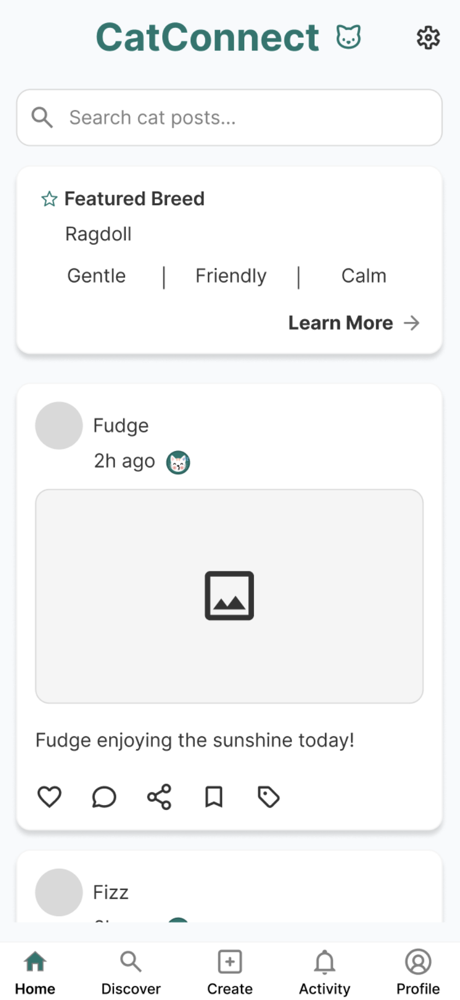
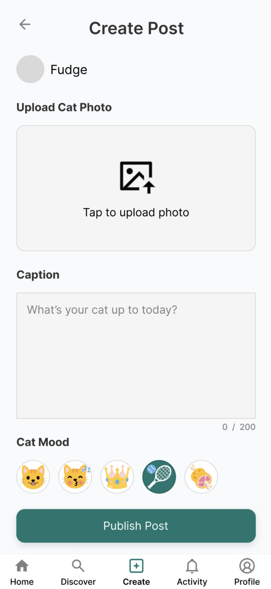
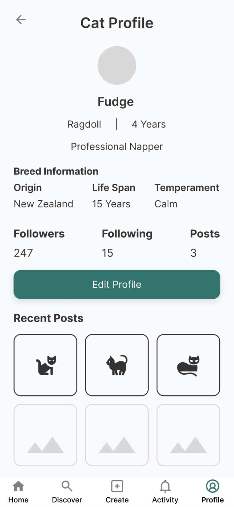
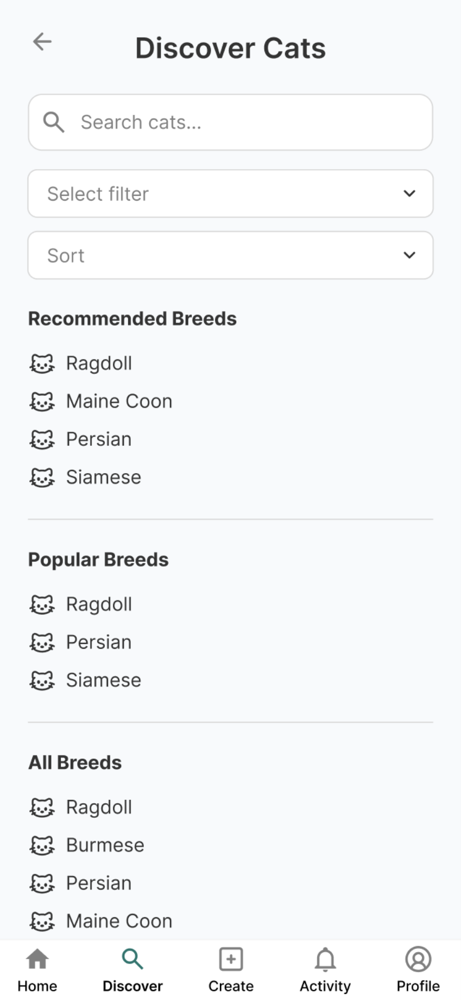
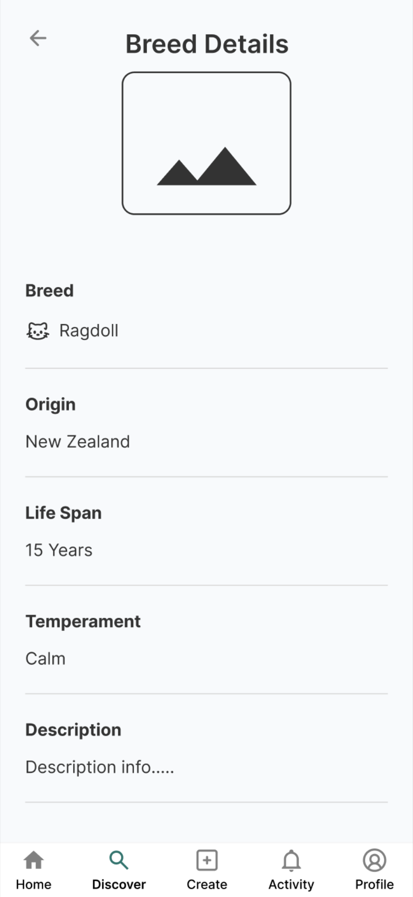
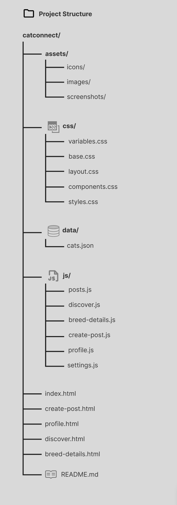
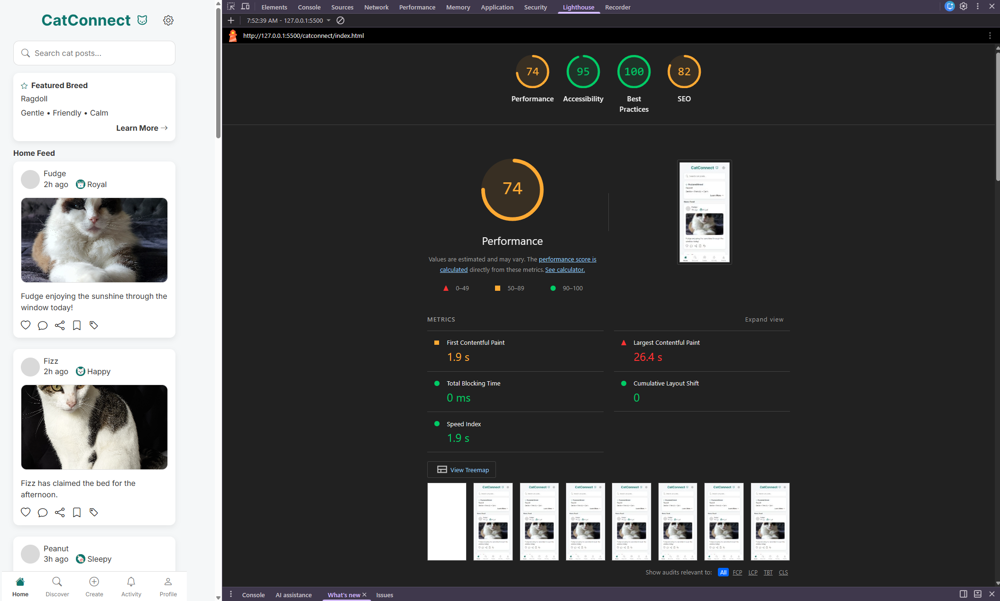

# 🐱 CatConnect

| Project         | CatConnect                                       |
| --------------- | ------------------------------------------------ |
| Course          | University of Canterbury – Software Engineering  |
| Tech Stack      | HTML5, CSS3, JavaScript (ES6), Bootstrap 5       |
| External API    | The Cat API                                      |
| Internal Data   | Local JSON (`cats.json`)                         |
| Design Approach | Mobile-first design, optimised for 390px screens |

---

## 📖 Overview

CatConnect is a mobile-first social web application designed for cat lovers. The application combines a social media-style feed with breed discovery, allowing users to browse cat posts, create posts, discover cat breeds, view detailed breed information from an external API, and personalise their experience through application settings.

This project was developed as part of the **University of Canterbury Software Engineering** programme.

---

## 🎨 Design Process

The project followed a user-centred design process that included:

- Project Brief
- Persona
- User Stories
- Problem Statement
- How Might We statement
- User Flow
- High-Fidelity Prototype

---

## 🎯 Project Goal

Create a dedicated platform where cat lovers can:

- View cat posts
- Share cat content
- Discover cat breeds
- Learn about breed characteristics
- Save favourite breeds
- Personalise their experience

---

## 👥 Target Users

- Cat owners
- Cat enthusiasts
- Pet communities

---

## ✨ Features

### 🏠 Home Feed

- View cat posts
- Search cat posts
- Dynamic post cards generated from a local JSON file

### ➕ Create Post

- Upload cat photo
- Caption input
- Mood selection
- Character counter
- Form validation
- Success and error feedback

### 🔍 Discover Cats

- Search breeds
- Filter breeds
- Sort breeds
- Recommended breeds
- Popular breeds
- Complete breed list

### 🐱 Breed Details

- Breed image
- Origin
- Description
- Life span
- Temperament
- Trait chips
- Breed statistics chart
- Save favourite breed
- Open Wikipedia page

### 👤 Cat Profile

- View cat profile
- Breed information
- Statistics
- Recent posts
- Edit Profile

### ⚙️ Settings

- Light / Dark theme
- Remember theme
- Clear saved breeds
- Reset preferences

---

## 📱 Screenshots

### 🏠 Home Feed

---

### ➕ Create Post

---

### 👤 Cat Profile

---

### 🔍 Discover Cats

---

### 🐱 Breed Details

---

## 📁 Project Structure

The project has been organised using a modular folder structure to separate HTML, CSS, JavaScript, assets, and data files.

---

## 🛠️ Tech Stack Used

- HTML5
- CSS3
- JavaScript (ES6)
- Bootstrap 5
- Bootstrap Icons
- Chart.js
- The Cat API
- Local JSON
- Local Storage
- Figma (UI/UX Design)

---

## 📂 Data Sources

### External API

The application uses **The Cat API** to retrieve live breed information.

The API provides:

- Breed names
- Breed descriptions
- Temperament
- Origin
- Life span
- Breed statistics
- Reference image IDs
- Wikipedia links

This data are used throughout the:

- Discover Cats page
- Breed Details page
- Statistics chart
- Trait chips
- Wikipedia button

### Internal JSON

A local `cats.json` file stores the application's social content.

Each post contains:

- Cat name
- Breed
- Age
- Time
- Caption
- Mood
- Image path

The JSON data is dynamically rendered into reusable HTML templates to create:

- Home Feed posts
- Cat Profile information
- Recent Posts

---

## 💻 JavaScript Concepts Demonstrated

The project demonstrates the use of:

- Fetch API
- Async / Await
- DOM Manipulation
- Event Listeners
- HTML Templates
- Local Storage
- Arrays
- Objects
- Functions
- Array Methods
  - `forEach()`
  - `find()`
  - `filter()`
  - `sort()`
- Conditional Rendering
- Template Literals
- Nullish Coalescing Operator (`??`)

---

## ♿ Accessibility

The application includes:

- Semantic HTML
- Mobile-first design
- Accessible form labels
- ARIA labels
- Keyboard focus states
- Accessible navigation

---

## 🔎 Quality Assurance

The application was tested using Chrome DevTools Lighthouse to review performance, accessibility, best practices, and SEO.

---

## 🚀 Future Improvements

Future versions of CatConnect could include:

### User Features

- User authentication and profiles
- Activity feed
- Comments and likes
- Follow other users
- AI chatbot for cat breed recommendations and cat care advice
- AI-generated post caption suggestions

### User Experience Improvements

- Standardise validation and feedback messages across the application.
- Drag-and-drop image uploads
- Desktop tooltips for additional guidance
- Deep linking from Featured Breeds to breed details
- Responsive layouts for tablet and desktop screen sizes

### Technical Enhancements

- Cloud database integration
- Real image uploads
- Refactor reusable HTML templates into reusable React components
- Backend authentication and user management

### Accessibility Improvements

- Skip to Main Content link
- Dark mode contrast testing
- Reduced motion accessibility option
- Additional keyboard navigation enhancements
- Further Lighthouse optimization

---

## 👩‍💻 Author

**Shenene Carstens**

University of Canterbury – Software Engineering

Delivered in collaboration with the Institute of Data

2026
